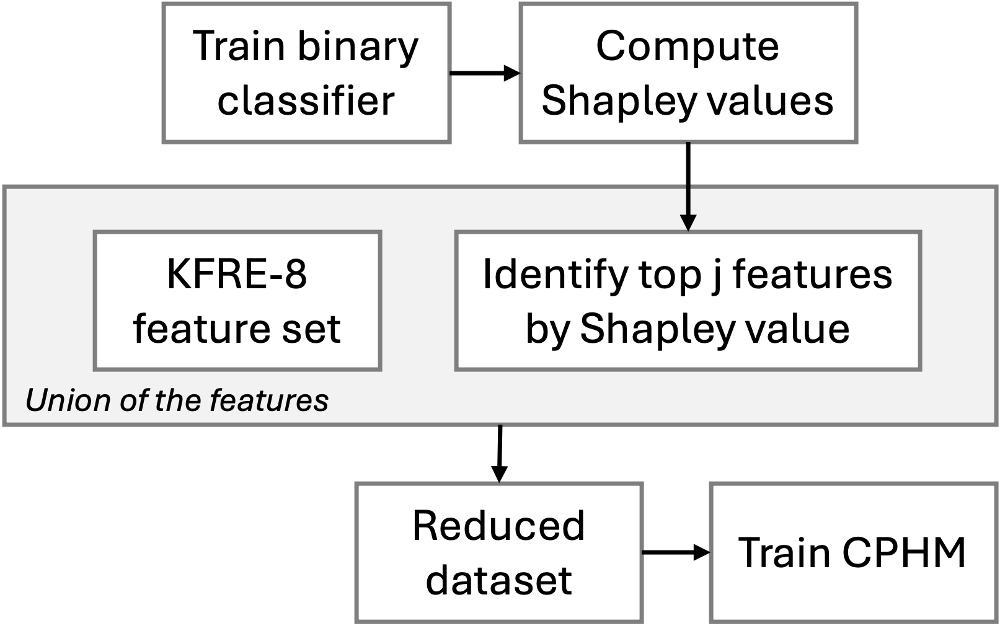

<h1 align='center'>Integrated Machine Learning and Survival Analysis Modeling for Enhanced Chronic Kidney Disease Risk Stratification</h1>
<h3 align='center'>ML-CKD Risk Stratification Pipeline</h3>

<div align="center">

<!--  -->


</div>

This repository contains the code for the paper _Integrated Machine Learning and Survival Analysis Modeling for Enhanced Chronic Kidney Disease Risk Stratification_.

If you found this library useful, please cite our [paper](https://arxiv.org/pdf/2411.10754).

```bibtex
@misc{dana2024integratedmachinelearningsurvival,
      title={Integrated Machine Learning and Survival Analysis Modeling for Enhanced Chronic Kidney Disease Risk Stratification}, 
      author={Zachary Dana and Ahmed Ammar Naseer and Botros Toro and Sumanth Swaminathan},
      year={2024},
      eprint={2411.10754},
      archivePrefix={arXiv},
      primaryClass={cs.LG},
      url={https://arxiv.org/abs/2411.10754}, 
}
```